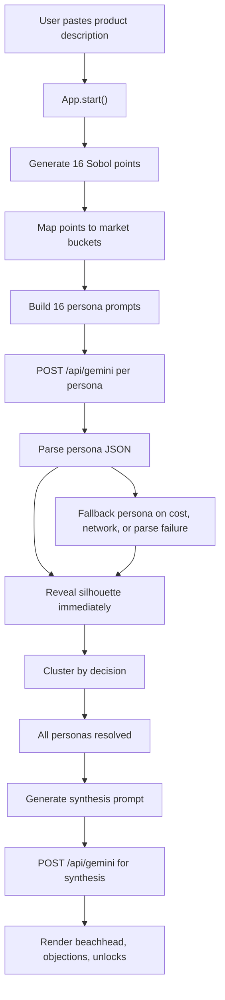

# Persona Initial Version - Workflow Logic Report

Source inspected: `$LEGACY_REPO`

This report documents the logic adopted by the recovered initial version of Persona, which was named `T2B` in the project files. The product is a synthetic market feedback tool: the user pastes a project or product description, the app generates sixteen synthetic personas, each persona reacts to the idea, and the UI clusters the results into market signal.

## Executive Summary

The workflow is built around a simple but opinionated loop:

1. The user enters a product description.
2. The app samples sixteen market positions across four fixed axes.
3. Each sampled position becomes a persona prompt, grounded in source fragments.
4. Sixteen independent Gemini calls run in parallel.
5. Each persona appears as soon as its own call resolves.
6. Personas are clustered into `WOULD_PAY`, `NEEDS_PROOF`, and `HARD_NO`.
7. Once all personas resolve, a synthesis prompt compresses the reactions into founder guidance: where to start, what blocks adoption, and what would unlock the doubters.

The important design choice is that the UI is not just displaying generated text. It stages a market simulation. Diversity comes from Sobol sampling, grounding comes from source fragments, signal comes from the three decision clusters, and founder-facing direction comes from the final synthesis pass.

## Repository Shape

The recovered repo is a compact full-stack prototype:

| Area | Role |
| --- | --- |
| `src/App.jsx` | Main React orchestrator: input, state transitions, progressive reveal, clustering, drawer, letter panel, synthesis display. |
| `src/lib/sobol.ts` | Generates four-dimensional Sobol samples and maps them into fixed market buckets. |
| `src/lib/pipeline.ts` | Runs persona generation, parsing, fallback handling, and progressive reveal callbacks. |
| `src/lib/persona-prompt.ts` | Builds the per-persona Gemini prompt from the user idea, Sobol buckets, urgency tone, and source fragments. |
| `src/lib/parse-persona.ts` | Validates generated persona JSON and bounds-checks cited fragment indices. |
| `src/lib/synthesis.ts` and `src/lib/synthesis-prompt.ts` | Run the second AI pass that turns sixteen reactions into strategic synthesis. |
| `src/components/personas.js` | Static fallback/demo personas and fragment bundles. Also serves as seed data for runtime generation. |
| `src/components/synthesis.jsx` | Renders the synthesis sections. |
| `server/index.js` | Minimal Express server, Gemini proxy, cost tracking, static `dist` serving. |
| `vite.config.js` | Vite dev server and `/api` proxy to Express. |

The app uses React 18, Vite, Express, Gemini, `lobos` for Sobol sampling, and `p-limit` for fan-out. See [package.json]($LEGACY_REPO/package.json:6).

## Runtime Architecture



The browser mounts `App` from [src/main.jsx]($LEGACY_REPO/src/main.jsx:5). The app imports the static personas, Sobol sampler, generation pipeline, and synthesis flow at [src/App.jsx]($LEGACY_REPO/src/App.jsx:1).

## Core Workflow Logic

### 1. Initial State

`App` begins with static personas from `PERSONAS`:

- `text`: the user's product description.
- `phase`: `"idle"`, `"resolving"`, or `"ready"`.
- `resolved`: a `Set` of persona ids that have completed.
- `personas`: initially the static demo/fallback persona list.
- `focused`: the selected persona for the letter panel.
- `drawer`: whether the methodology drawer is open.
- `synthesis`: the final strategic summary.

These state fields are declared around [src/App.jsx:799]($LEGACY_REPO/src/App.jsx:799).

The static `PERSONAS` list is not only placeholder UI data. It also provides the prewritten fragment bundles used during live generation. The file describes the locked persona schema and fallback distribution at [src/components/personas.js:1]($LEGACY_REPO/src/components/personas.js:1).

### 2. User Starts A Run

When the user clicks the main button, `start()` executes:

- Empty input is ignored.
- The phase becomes `"resolving"`.
- `resolved`, `focused`, and `synthesis` are reset.
- Personas are reset back to the static list.
- Sixteen Sobol points are generated.
- Fragment bundles are pulled from the static personas.
- `generatePersonas()` is called with a callback that updates one persona at a time.

This is implemented at [src/App.jsx:834]($LEGACY_REPO/src/App.jsx:834).

### 3. Sobol Sampling Creates The Market Space

The project uses four fixed axes:

- `company_size`: `solo`, `10-50`, `50-500`, `500-5000+`
- `role_seniority`: `junior`, `mid`, `senior`, `exec`
- `problem_urgency`: `vague-curiosity`, `considering`, `active-pain`, `burning-now`
- `region`: `North America`, `Europe`, `APAC`, `LATAM`

The `sobolSample(n)` function calls `new Sobol(4).take(n)`, then `mapToAxes()` buckets each raw coordinate into one of four values per axis. See [src/lib/sobol.ts:8]($LEGACY_REPO/src/lib/sobol.ts:8) and [src/lib/sobol.ts:22]($LEGACY_REPO/src/lib/sobol.ts:22).

Why Sobol matters here:

- It gives broad coverage of the four-dimensional space with only sixteen points.
- It avoids relying on prompt luck for persona diversity.
- It preserves raw continuous values for the methodology scatterplot.
- It also stores bucketed values for the prompt.

The methodology drawer says this explicitly in the UI: each persona is fixed by a Sobol quasi-random point, and the final cluster is the result of each persona reacting to the product, not a label assigned up front. See [src/App.jsx:634]($LEGACY_REPO/src/App.jsx:634).

### 4. Persona Generation Fan-Out

`generatePersonas()` is the main workflow engine. It receives:

- the product description,
- sixteen Sobol points,
- sixteen fragment bundles,
- an `onPersonaReady` callback.

For each Sobol point, it:

1. Computes the persona id.
2. Converts the Sobol point into a stored `sobol_position`.
3. Builds a persona prompt.
4. Calls `POST /api/gemini`.
5. Parses the returned JSON.
6. Revalidates the decision.
7. Falls back safely on failures.
8. Deduplicates repeated names.
9. Fires `onPersonaReady()` as soon as that persona resolves.

This flow is in [src/lib/pipeline.ts:22]($LEGACY_REPO/src/lib/pipeline.ts:22).

The reveal callback is the key UI logic. It is fired at [src/lib/pipeline.ts:65]($LEGACY_REPO/src/lib/pipeline.ts:65), then `App` replaces that single persona and adds its id to the `resolved` set at [src/App.jsx:845]($LEGACY_REPO/src/App.jsx:845).

This makes the reveal promise-resolution-driven. The silhouettes do not appear on a fixed timer. They appear when their corresponding AI calls finish.

One implementation note: the original project docs say `p-limit(4)` was intended, but the current code sets `pLimit(16)` at [src/lib/pipeline.ts:20]($LEGACY_REPO/src/lib/pipeline.ts:20). That means all sixteen persona calls can run concurrently.

### 5. Prompt Logic

The persona prompt has three layers:

1. Identity coordinates from the Sobol buckets.
2. Context fragments from real-ish public artifacts.
3. The user's product description.

The prompt tells Gemini to become the persona, react to the product, and choose exactly one of:

- `WOULD_PAY`
- `NEEDS_PROOF`
- `HARD_NO`

It also imposes strong voice constraints: direct editor voice, concrete day-to-day references, no generic AI phrasing, no startup cliches, no broad abstractions, and citation of only the fragments that directly informed the decision. See [src/lib/persona-prompt.ts:22]($LEGACY_REPO/src/lib/persona-prompt.ts:22).

`problem_urgency` changes persona behavior through `URGENCY_TONE`. For example, `burning-now` explicitly biases toward action unless the product clearly cannot help. See [src/lib/persona-prompt.ts:3]($LEGACY_REPO/src/lib/persona-prompt.ts:3).

The expected output is fenced JSON with:

- `name`
- `one_line_situation`
- `decision`
- `reasoning`
- `what_would_change_my_mind`
- `cited_fragment_indices`

The parser then attaches runtime fields like `id`, `fragments`, `sobol_position`, and `low_grounding`.

### 6. Parsing And Failure Logic

`parsePersona()` strips markdown fences, parses JSON, validates all required fields, validates the decision enum, and filters hallucinated source indices. See [src/lib/parse-persona.ts:5]($LEGACY_REPO/src/lib/parse-persona.ts:5).

Failures do not break the workflow. `fallbackPersona()` returns a valid `Persona` with:

- `name: "(unsummoned)"`
- `decision: "HARD_NO"`
- a reason such as `cost-cap`, `network`, or `parse`
- empty citations
- `low_grounding: true`

This keeps the sheet complete even when the model, network, parser, or cost cap fails.

### 7. Cluster Layout

The visual market map clusters personas by their decision:

- left: `WOULD_PAY`
- middle: `NEEDS_PROOF`
- right: `HARD_NO`

The mapping from locked schema values to internal layout keys lives in `DKEY` at [src/App.jsx:21]($LEGACY_REPO/src/App.jsx:21).

`clusterLayout()` groups personas by decision, gives each cluster a center, places each member around an ellipse, then runs collision relaxation so silhouettes do not overlap badly. It also clamps personas into their horizontal decision lanes. See [src/App.jsx:38]($LEGACY_REPO/src/App.jsx:38).

This means the x-position on the main sheet is not the Sobol coordinate. The main sheet is an outcome cluster. The Sobol coordinates are shown separately in the methodology drawer's scatterplot.

### 8. Detail Views

After generation, the user can inspect two levels of detail.

#### Letter Panel

Clicking a silhouette opens a panel with:

- persona name,
- one-line situation,
- decision pill,
- reasoning,
- what would change their mind,
- source fragments and links,
- a low-grounding indicator when applicable.

The panel starts at [src/App.jsx:414]($LEGACY_REPO/src/App.jsx:414). It highlights the most product-relevant sentence from the reasoning using `pickFeedbackSentence()` at [src/App.jsx:370]($LEGACY_REPO/src/App.jsx:370).

#### Methodology Drawer

The methodology drawer explains how the market was created, visualizes Sobol positions across selectable axis pairs, and lists source provenance for every persona. It starts at [src/App.jsx:580]($LEGACY_REPO/src/App.jsx:580).

The scatterplot uses raw Sobol coordinates from `persona.sobol_position`, not the final cluster coordinates. See [src/App.jsx:710]($LEGACY_REPO/src/App.jsx:710).

### 9. Synthesis Pass

After all sixteen personas finish, `start()` marks the phase `"ready"` and calls `generateSynthesis(finalPersonas)`. See [src/App.jsx:864]($LEGACY_REPO/src/App.jsx:864).

The synthesis prompt asks Gemini to read all sixteen reactions and produce:

- `beachhead`: who the founder should sell to first,
- `objections`: two to three blockers from `NEEDS_PROOF` and `HARD_NO`,
- `unlocks`: two to three concrete asks that would convert doubters.

Each objection or unlock must cite supporting persona ids. Themes citing fewer than two personas are dropped client-side. See [src/lib/synthesis-prompt.ts:31]($LEGACY_REPO/src/lib/synthesis-prompt.ts:31) and [src/lib/synthesis-prompt.ts:91]($LEGACY_REPO/src/lib/synthesis-prompt.ts:91).

The rendered synthesis has three user-facing sections:

- "where to start"
- "what's stopping the rest"
- "what unlocks them"

Rendering happens in [src/components/synthesis.jsx:10]($LEGACY_REPO/src/components/synthesis.jsx:10).

## Backend And API Boundaries

The backend is intentionally small. Express exposes:

| Endpoint | Purpose |
| --- | --- |
| `GET /api/cost` | Returns in-memory total Gemini spend and the soft abort threshold. |
| `POST /api/gemini` | Accepts a prompt, calls Gemini, returns generated text plus token and cost metadata. |

The server initializes Gemini with `GEMINI_API_KEY` and model `gemini-2.5-flash` at [server/index.js:15]($LEGACY_REPO/server/index.js:15).

Cost tracking is process-memory only:

- `SOFT_ABORT_USD = 15`
- `totalUsd` starts at `0`
- input and output token counts are priced after each successful call
- once `totalUsd >= 15`, `/api/gemini` returns `429` with `error: "cost-cap"`

See [server/index.js:7]($LEGACY_REPO/server/index.js:7) and [server/index.js:34]($LEGACY_REPO/server/index.js:34).

There is no database, user account system, persistent run storage, queue, job table, or server-side workflow state. The frontend owns the run state. The server owns the API key, Gemini calls, and cost guard.

During local development, Vite runs on port 3000 and proxies `/api` to Express on port 8080. See [vite.config.js]($LEGACY_REPO/vite.config.js:6).

## State Machine

The app has a simple state machine:

| Phase | Meaning | User-visible behavior |
| --- | --- | --- |
| `idle` | No active run | Input is available, silhouettes are hidden/offscreen. |
| `resolving` | Persona calls are in flight | Status shows `Resolving sixteen personas - N of 16`; silhouettes appear one by one. |
| `ready` | All personas returned or fell back | User can click silhouettes, open methodology, and read synthesis once it arrives. |

The phase text is rendered at [src/App.jsx:895]($LEGACY_REPO/src/App.jsx:895).

The model is tolerant of partial failure: a run can still become `"ready"` even if some personas are fallback personas.

## Adopted Product Logic

The old implementation encodes several product beliefs:

1. Feedback should be specific, not averaged.
   Sixteen separate personas are generated instead of one generic market summary.

2. Diversity should be engineered.
   Sobol sampling forces coverage across company size, seniority, urgency, and region.

3. Synthetic output needs receipts.
   Each persona carries source fragments and cited indices. The UI shows those fragments rather than hiding the basis for the reaction.

4. The outcome matters more than the persona bio.
   The main visual clusters personas by buying decision, not demographic attributes.

5. The demo should feel alive.
   Personas reveal as promises resolve, which turns backend latency into staged market emergence.

6. The founder needs synthesis, not just artifacts.
   The final pass converts sixteen opinions into where to start, what blocks adoption, and what would convert skeptics.

7. Failure should degrade visibly but gracefully.
   Cost, network, and parse failures produce low-grounding fallback personas rather than a broken sheet.

## Gaps And Risks Observed

These are not necessarily bugs to fix now, but they matter if the recovered logic is reused.

| Area | Observation |
| --- | --- |
| Source acquisition | The code uses static fragments from `PERSONAS`; there is no live Tavily or source-search pipeline in the recovered implementation. |
| Concurrency | Project docs mention `p-limit(4)`, but code currently allows 16 concurrent persona calls. |
| Persistence | Cost tracking is in memory. Restarting the server resets it. Runs are not saved. |
| Validation | Persona and synthesis parsing is defensive, but there are no visible unit tests in the recovered repo. |
| Backend role | The server is only a proxy plus cost meter. All orchestration lives in the client. |
| Cluster classifier | `classifyCluster()` currently trusts the parsed decision if it is one of the valid enum values. It does not infer sentiment from reasoning. |
| Static seed data | `PERSONAS` serves both as demo data and fragment source data, which is convenient but couples the live workflow to the demo fixture. |

## Suggested Mental Model

The cleanest way to describe the workflow is:

> Persona creates a small synthetic market, asks every sampled buyer the same question, shows their decisions as a live market map, then compresses the signal into founder-facing next steps.

Technically, that means:

```text
Product description
  -> Sobol market coordinates
  -> grounded persona prompts
  -> parallel Gemini reactions
  -> validated Persona objects
  -> progressive silhouette reveal
  -> decision cluster map
  -> synthesis of beachhead, objections, unlocks
```

## Files Most Worth Reading Next

If you want to revive or evolve this version, read these in order:

1. [src/App.jsx]($LEGACY_REPO/src/App.jsx:785) - the orchestration and UI state.
2. [src/lib/pipeline.ts]($LEGACY_REPO/src/lib/pipeline.ts:22) - the generation workflow.
3. [src/lib/persona-prompt.ts]($LEGACY_REPO/src/lib/persona-prompt.ts:22) - the core persona contract.
4. [src/lib/sobol.ts]($LEGACY_REPO/src/lib/sobol.ts:8) - the market sampling scheme.
5. [src/lib/synthesis-prompt.ts]($LEGACY_REPO/src/lib/synthesis-prompt.ts:31) - the founder-facing synthesis contract.
6. [server/index.js]($LEGACY_REPO/server/index.js:34) - the API and cost boundary.

